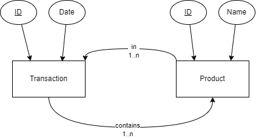

# shopping-cart-analysis-neo4j
Neo4j has been around for quite a while and more NoSQL databases keep popping up (e.g., [SurrealDB](https://surrealdb.com/)). In order to test the capabilites of graph databases, this repo aims to perform a shopping cart (also known as market basket) analysis on grocery purchases.
The dataset employed can be found on Kaggle at: https://www.kaggle.com/datasets/acostasg/random-shopping-cart

After ingestion the data is modelled as follows


## How to run this code?
1. Download the [Kaggle dataset mentioned above](https://www.kaggle.com/datasets/acostasg/random-shopping-cart)
2. Extract `dataset_group.csv` from the downloaded archive and place it in the `./data/` directory of this project
3. Create a virtual environment 
    ```sh
    # replace <path_to_your_venv> with something like ./venv 
    python -m venv <path_to_your_venv>
    ```
4. Activate the environemnt
    ```sh
    <path_to_your_venv>/Scripts/activate.[ps1|bat|sh]
    ```
5. Install all dependencis
    ```sh
    pip install -r requirements.txt
    # alternative if pip is available under pip3
    pip3 install -r requirements.txt
    ```
6. (optional) Deploy the Neo4j db locally
    ```sh
    docker-compose up -d
    ```
7. Validate credentials and URL used to connect to Neo4j (cell 5 in `notebook.ipynb`)
    ```python
    # These are the settings required for the db created with docker-compose
    conn = Neo4jConnection("bolt://localhost:7687", "neo4j", "!Random_Password1234")
    ```
8. Run all notebook cells to populate the DB and define the required methods

## Theory
The following definitions and formula are based on:
* [Affinity Analysis (Market Basket Analysis)](https://towardsdatascience.com/affinity-analysis-market-basket-analysis-c8e7fcc61a21)
* [Interesting association rule mining with consistent and inconsistent rule detection from big sales data in distributed environment](https://www.sciencedirect.com/science/article/pii/S2314728816300460)

### Itemset
The distinct set of items found in the Dataset `D` is described as

$$ I = \{i_1, i_2, ..., i_n\} $$

`X` and `Y` as subsets of `I` could be defined as

$$ X = \{i_1, i_n\} $$
$$ Y = \{i_2\} $$

### Support
The support measures the percentage of transactions in the dataset that contain both itemsets X and Y (X &rarr; Y)

$$ Support(X \,\to\, Y) = Support (X \cup Y) = P(X \cup Y) $$ 

### Confidence
Based on conditional probability, the confidence for Y based on the existence of X will be calculated - in this notation the `Support(X)` is the same as `P(X)`. It describes how likely `Y` is purchased if a customer had already bought `X`.

$$ Confidence(X \,\to\, Y) = P(Y \mid X) = \frac{Support (X \cup Y)}{Support(X)} $$ 

### Lift
The lift describes how `X` influences the likelihood for `Y` to be purchased.
Thus, a value higher than 1 hints at both products being purchased together rather often, is the value lower than 1 this is quite unlikely.

$$ Lift(X \,\to\, Y) = \frac{Support(X \,\to\, Y)}{Support(X)*Support(Y)} = \frac{P (X \cup Y)}{P(X)*P(Y)} $$ 

### Conviction
To measure the frequency that `X` occurs without `Y` the conviction is calculated:

$$ Conviction(X \,\to\, Y) = \frac{1-Support(Y)}{1-Confidence(X \,\to\, Y)} $$